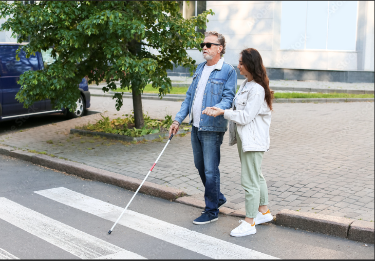
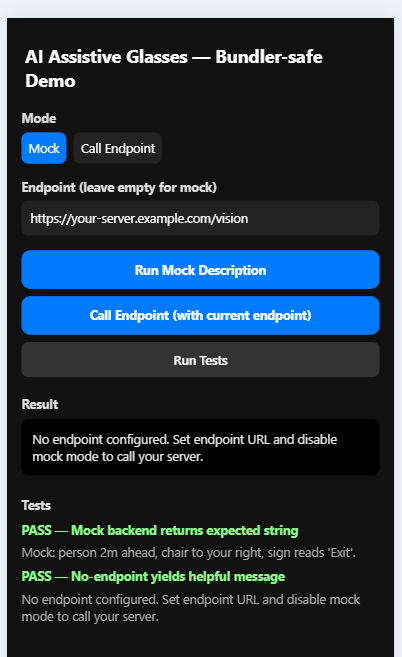

# AI-VISION-GLASSES-V1

AI vision glasses for the Visually Impaired/ Blind community
AI usecase running on LLM that does object/image detection + text detection + audio, enabling blind users to read text, identify faces, get semantic descriptions

Integration of object detection + OCR + Test to Speech

🛠 How You Can Use this repo to Adapt

Modularize: Pick modules you need (e.g. object detection, OCR, face recognition, distance estimation) and integrate them into your own architecture.

Hardware adaptation: you might want to port to a more powerful embedded device (e.g. Jetson, edge-AI modules) for better performance.

Latency & real-time: Those repos often serve as proofs-of-concept; improving inference speed, model optimization, and resource usage will be key.

Audio feedback design: The way the system speaks (timing, priority, phrasing) matters a lot for usability.

Edge vs cloud tradeoffs: Use smart offloading (some tasks on-device, some on server) as in the iEARS project.


## Demo App:



## Running the App on Web (React Native Web)

1. **Install dependencies**  
   Open a terminal in the project root and run:
   ```bash
   cd ai-vision-glasses-v1
   npm install
   ```

2. **Start the web server**  
   Run:
   ```bash
   npm start
   ```
   or
   ```bash
   npx expo start --web
   ```

3. **Open the app in your browser**  
   If running in a dev container, use:
   ```bash
   $BROWSER http://localhost:19006
   ```
   Or open the URL shown in the terminal.

---

**Note:**  
- This app is designed to run with React Native Web and does not require Expo native modules.
- If you want to run on mobile (with camera/speech), ask for `App.native.js` instructions.

